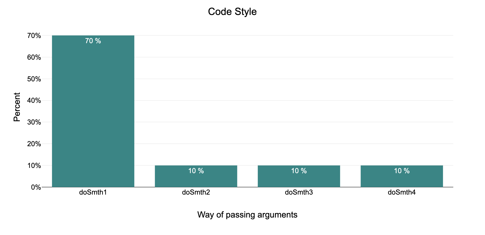
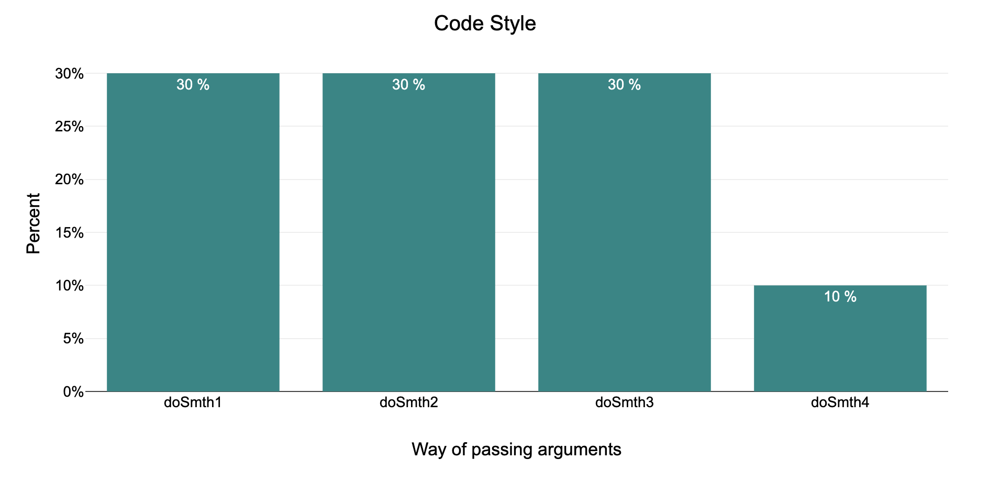

**KaiCop** stands for [KaiCode](https://www.kaicode.org/2024.html) and [Cop](https://en.wikipedia.org/wiki/Cop).

To measure code quality in a large number of projects,
we need to have some metric that is not tied to the programming language and its paradigm.
We can't rely on any specific rules, because the rules of writing quality code in procedural
style and functional style will be completely different.
To solve this problem, KaiCop proposes the idea of comparing code _consistency_ within a project.
This metric will not be tied to the language, paradigm, etc.

### Example:

*Warning – This example just shows a measurement method. The set of rules will be different for each project.*

We're having 10 methods in the project.

```java
public static void doSmth1(int first, int second) {
    // code
}


public static void doSmth2(
    int first, int second
) {
    // code
}

public static void doSmth3(
    int first,
    int second
) {
    // code
}

public static void doSmth4(
    int first, int second) {
    // code
}
```

7 out of 10 written like in style of `doSmth1`.
One written like `doSmth2`, one written like `doSmth3`, one written like `doSmth4`. Now we can build a histogram like this one



We have another project which histogram looks like this



Now we can say that in the first case, the quality of the code is much higher than in the second. The code in the first project was written more *consistently*. As for the quality of the code for many **completely different** projects, we cannot follow **certain rules**. The code will be more readable and maintainable, just if it is consistent; with one style, with a set of design rules (which are defined in some place) that will limit the execution of incorrect design decisions. If we look at our example. We can say that an ideal project will have only one style of argument passing, and it doesn't matter what style it will be. For example, `doSmth1` or `doSmth3`, or something else.[](https://) When we get an almost 100% match on a case, it means that the project has:

1. Linting or auto checkstyle check built into CI
2. Good code review process

Or both of them.

### How to define consistency

To determine the consistency of a project, we can scan its codebase. During the scanning process, we need to identify several approaches, design principles, etc. that have been used. When we have a set of rules for a specific project, it becomes possible to calculate how the code was distributed, grouping according to these rules. If the distribution looks like in the second example, we can say that the code is not consistent and the code quality is low. The next question is how to define these rules? The problems of classifying things are generally the most difficult. It would be impossible to create such an algorithm, but LLM models could be a good solution for classifying rules.
